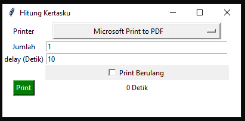

# hitung-kertas-dengan-printer

Karna ada keperluan internal untuk menghitung kertas dengan printer jadi terciptalah program ini menggunakan python. 
jadi prosesnya program akan melakukan pencetakan tanpa ada tulisan atau apapun jadi kertas yang keluar tetap polos 

## Preview

